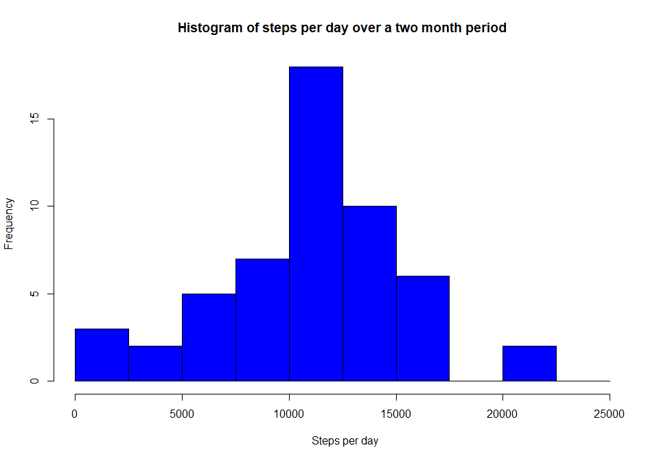
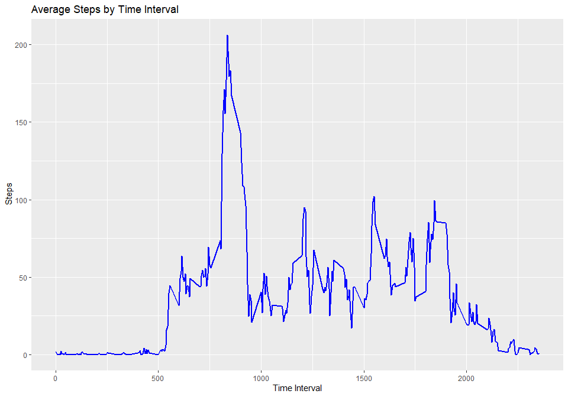
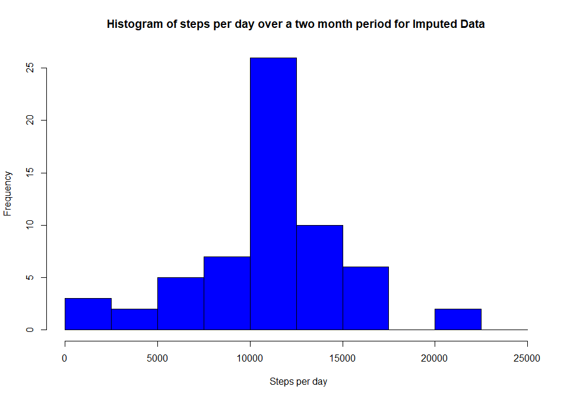
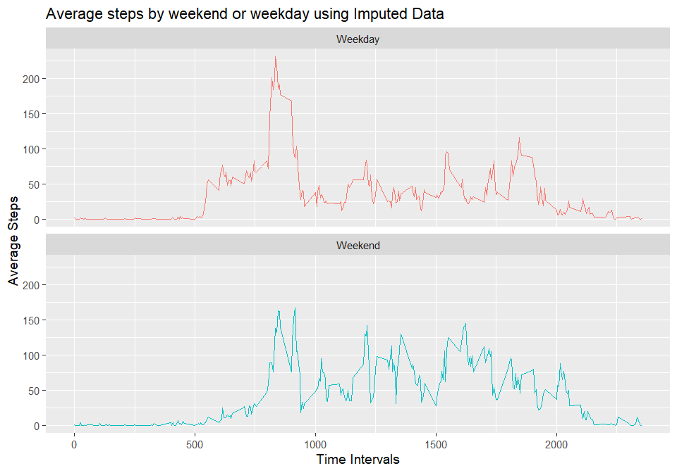

### Author:  Ted Buckless
## Introduction of Project:

### This assignment makes use of data from a personal activity monitoring device. The data was  collected at 5 minute intervals throughout the day for 2 months. An anonymous individual was used to collect measurements from during the months of October and November, 2012 and include the number of steps taken in 5 minute intervals for each day.

### The assignment was to make a single markdown document to prepare (code) and report the results.  I hope you enjoy it.  

...  
...  
...

### Set the Global Options 

```r
knitr::opts_chunk$set(echo = TRUE, warning = FALSE, fig.width = 10, fig.height = 7)
```
## Loading and preprocessing the data

```r
#Load the necessary libraries

library(dplyr)
```

```
## 
## Attaching package: 'dplyr'
```

```
## The following objects are masked from 'package:stats':
## 
##     filter, lag
```

```
## The following objects are masked from 'package:base':
## 
##     intersect, setdiff, setequal, union
```

```r
library(ggplot2)

path = getwd()
unzip("activity.zip", exdir = path)
adata <- read.csv("activity.csv")                        # Read the File in

adata$date <- strptime(adata$date, "%Y-%m-%d")            # Convert the time to Posix format
adata$weekday <- weekdays(adata$date)                     # Create a day of week variable
adata$dateF <- as.factor(adata$date)                      # Make date a factor for tapply
summary(adata$steps)                                      # Print a quick summary out
```

```
##    Min. 1st Qu.  Median    Mean 3rd Qu.    Max.    NA's 
##    0.00    0.00    0.00   37.38   12.00  806.00    2304
```
### Above is a  quick summary of the Data

<br>
<br>


## Compute the  mean and Median total number of steps taken per day. Include a Histogram


```r
                                                      # astep = average steps per day
astep <- tapply(adata$steps, adata$dateF, sum)        #Compute the average steps per day

hist(astep, breaks = seq(0, 25000, length.out = 11), col = "blue",
xlab = "  Steps per day", main = "Histogram of steps per day over a two month period")
```

<!-- -->

```r
meanS <-  mean(astep,na.rm=TRUE)
medS  <-  median(astep,na.rm=TRUE)
sd(astep,na.rm = TRUE)
```

```
## [1] 4269.18
```
### *The Mean is 10766 steps  and the Median is10765 steps*
<br>
<br>

## Look at the average daily activity pattern. Show which 5 minute interval contains the maximum number of steps.

```r
#Average by Time Interval                        b = dataframe with NA's removed
b <- na.omit(adata)                              # Remove the NA's
mbda <- aggregate(x = b$steps,                   # Specify data column   
         by = list(b$interval),                  # Specify group indicator
         FUN = mean)                             # Specify function (i.e. sum)
                                                 # Compute mean by time interval
                                                 # mbda = mean by daily interval 
ggplot(mbda, aes(x = Group.1 , y = x)) + 
geom_line(color="blue", size = 1) + 
labs(title = "Average Steps by Time Interval", x = "Time Interval", y = " Steps")
```

<!-- -->

```r
maxS <- mbda[which.max(mbda$x),]                  #Find the interval for the Max(avg) number of Steps
```
### *The interval 835 contains the maximum number of steps.*
<br>
<br>

## Imputing missing values
###  1. Calculate the total number of missing values:
#### ... *The total number of NA's in the original data set is: 2304*
###  2. Devise a strategy and create a new dataset filling the NA's 
#### ...I decided to fill the missing values with the mean for each particular time interval

```r
# data_imp = is the dataframe that will hold the original data plus the imputed values
data_imp <- adata
mv <- is.na(data_imp$steps)
data_imp$steps[mv] <- mbda$x[(match(data_imp$interval[mv], mbda$Group.1))]
#  I used the missing value vector (mv) to point and fill data_imp with the imputed values
#  Recall that dataframe mbda holds the interval mean values
```
### 3. Make a Histogram and calculate the mean and median of the imputed data set 


```r
                                                             #imstep = average steps per day
imstep <- tapply(data_imp$steps, data_imp$dateF, sum)        #Compute the average steps per day

hist(imstep, breaks = seq(0, 25000, length.out = 11), col = "blue",
xlab = "  Steps per day", main = "Histogram of steps per day over a two month period for Imputed Data")
```

<!-- -->

```r
imeanS <- mean(imstep)
imedS <- median(imstep)
sd(imstep)
```

```
## [1] 3974.391
```
### *The Mean is 10766 steps  and the Median is10766 steps*
<br>
<br>

## Are there differences in activity patterns between weekdays and weekends?


```r
#Weekend or weekday script
c <- data_imp %>%
  mutate(WEWD = case_when(weekday == 'Sunday' ~ 'Weekend',
                          weekday == 'Monday' ~ 'Weekday',
                          weekday == 'Tuesday' ~ 'Weekday',
                          weekday == 'Wednesday' ~ 'Weekday',
                          weekday == 'Thursday' ~ 'Weekday',
                          weekday == 'Friday' ~ 'Weekday',
                          weekday == 'Saturday' ~ 'Weekend'))

mbwd <- aggregate(x = c$steps,            # Specify data column
         by = list(c$interval,c$WEWD ),   # Specify group indicator
         FUN = mean)                      # Specify function (i.e. sum)


ggplot(mbwd, aes(x=Group.1,y=x, color = Group.2 )) +
  geom_line(show.legend = FALSE) +
  facet_wrap(~Group.2, nrow = 2, ncol = 1)  +
  labs(title = "Average steps by weekend or weekday using Imputed Data", x = "Time Intervals", y = "Average Steps") +                                                 
  theme_grey(base_size = 14)
```

<!-- -->

